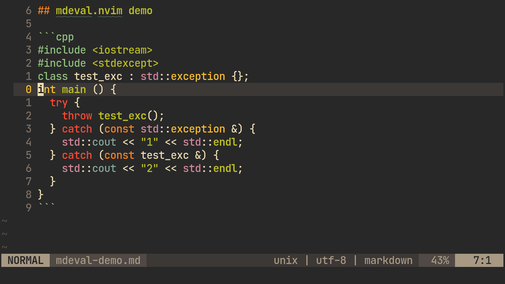

# mdeval.nvim

This plugin allows you evaluate code blocks inside markdown documents.

It attempts to implement the basic functionality of org-mode's [evaluating code blocks](https://orgmode.org/manual/Evaluating-Code-Blocks.html#Evaluating-Code-Blocks) feature inside Neovim.

## Demo



## Installation

This plugin requires Neovim version 0.5+.

Install it with plugin manager:

```
Plug 'jubnzv/mdeval.nvim'
```

Add the following line in your `init.lua`:

```lua
require 'mdeval'.setup()
```

You should also enable syntax highlighting inside code blocks in markdown using the built-in functionality.
Please define a list of markdown fenced languages in your configuration file:

```lua
vim.g.markdown_fenced_languages = {'python', 'cpp'}
```

MacOS users also should make sure that they have `coreutils` package installed:

```bash
brew install coreutils
```

## Usage

To use this plugin, you should move cursor inside a fenced code block with language identifier and execute the `:MdEval` command.
*mdeval.nvim* will capture the results of the code block execution and inserts them in the markdown file, right after the code block.

## Configuration

You can configure *mdeval.nvim* by running the `mdeval.setup` function.

Here is an example:

```lua
require 'mdeval'.setup({
  -- Don't ask before executing code blocks
  require_confirmation=false,
  -- Change code blocks evaluation options.
  eval_options = {
    -- Set custom configuration for C++
    cpp = {
      command = {"clang++", "-std=c++20", "-O0"},
    },
    -- Add new configuration for Crystal
    crystal = {
      command = {"crystal"},        -- Command to run interpreter
      language_code = "crystal",    -- Markdown language code
      exec_type = "interpreted",    -- compiled or interpreted
      extension = "cr",             -- File extension for temporary files
    },
  },
})
```

By default, the plugin will ask your confirmation before evaluating code. This makes sense, because code evaluation is potentially harm operation.
You can disable this feature setting `require_confirmation` option to `false`, or allow to execute code blocks without confirmation only for some languages, using `allowed_file_types` option, for example: `allowed_file_types={'rust', 'haskell'}`.

Probably, it will be a good idea to define keybindings to call `:MdEval`. This plugin doesn't add default keybindings, but you can do this in your configuration file, for example:

```lua
vim.api.nvim_set_keymap('n', '<leader>c',
                        "<cmd>lua require 'mdeval'.eval_code_block()<CR>",
                        {silent = true, noremap = true})
```

See the complete list of options in the [documentation](./doc/mdeval.txt).
